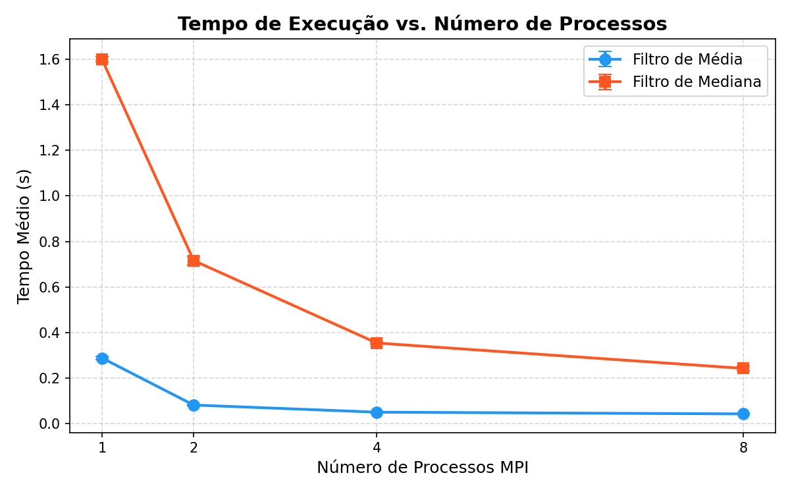
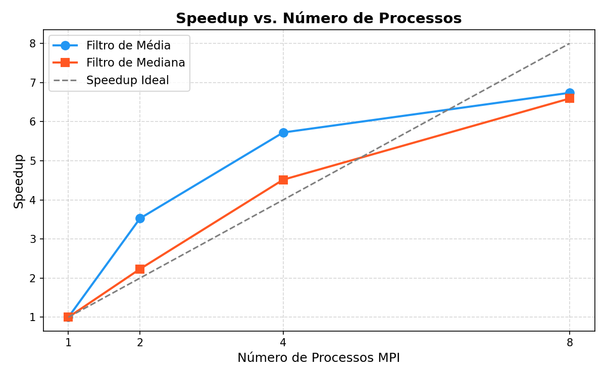

# Comparação de Filtros de Suavização com MPI

## Descrição
Este projeto implementa e compara os filtros de suavização de imagem (média 3x3 e mediana 3x3) nas versões sequencial e paralela com MPI, usando Python + mpi4py. A ideia central é demonstrar o ganho de desempenho utilizando paralelização e investigar o comportamento de cada filtro frente à troca de mensagens e divisão de fatias de processamento.

## Estrutura do Projeto
- `main.py` – Script principal MPI (ponto de entrada).
- `filters.py` – Implementação manual dos filtros (sem cv2.blur/medianBlur).
- `benchmark.py` – Funções de benchmark, estatísticas e geração de relatório dinâmico.
- `requirements.txt` – Dependências Python.
- `entrada.jpg` – (opcional) Imagem de entrada. Se ausente, uma imagem sintética 4000x4000 com ruído é gerada automaticamente.
- `output/` – Pasta criada automaticamente na execução, contendo:
  - `entrada_sintetica.png` – Imagem sintética gerada (se aplicável).
  - `seq_mean.png / seq_median.png` – Resultados sequenciais.
  - `par_Nproc_mean.png / par_Nproc_median.png` – Resultados paralelos.
  - `benchmark_results.csv` – Tabela de resultados em CSV.
  - `tempo_vs_processos.png` e `speedup_vs_processos.png` – Gráficos automáticos.
  - `relatorio.txt` – Relatório textual completo gerado na execução.

## Pré-requisitos
1. **Python 3.10+**
2. **MPI instalado no sistema:**
   - **Windows:** Microsoft MPI (MS-MPI) – [Link para download](https://github.com/microsoft/Microsoft-MPI/releases)
   - **Linux:** OpenMPI (`sudo apt install libopenmpi-dev openmpi-bin`)
   - **macOS:** OpenMPI (`brew install open-mpi`)

## Instalação (Windows / MS-MPI)
1. Acesse: https://github.com/microsoft/Microsoft-MPI/releases
2. Baixe e instale `msmpisetup.exe` (runtime) E `msmpisdk.msi` (SDK).
3. Reinicie o terminal após a instalação.
4. Verifique a instalação rodando no terminal: `mpiexec --version`

### 2️⃣ Instalação das Dependências Python (Com venv)
Recomenda-se o uso de um ambiente virtual para não gerar conflito com bibliotecas do sistema. Na raiz do projeto, execute:

```bash
# 1. Crie o ambiente virtual
python -m venv venv

# 2. Ative o ambiente virtual
.\venv\Scripts\activate

# 3. Instale as dependências
pip install -r requirements.txt
```
*(O que será instalado: `mpi4py`, `numpy`, `opencv-python` e `matplotlib`)*

## Execução Passo a Passo
Execute a partir da pasta do projeto, variando o número de processos para popular o gráfico completo de comparação. **Siga exatamente a ordem abaixo** se desejar colher todos os resultados para a avaliação e para os gráficos de benchmark:

```bash
# Versão com 1 processo (referência sequencial e baseline para os gráficos):
mpiexec -n 1 python main.py

# Versão paralela com 2 processos:
mpiexec -n 2 python main.py

# Versão paralela com 4 processos:
mpiexec -n 4 python main.py

# Versão paralela com 8 processos:
mpiexec -n 8 python main.py
```
> **Dica:** O script cria os relatórios de maneira unificada (salva no arquivo `output/historico.json`), então rodar sucessivamente os comandos acima fará com que o PDF e os gráficos sejam atualizados contemplando a todos os nós.

---

## 📊 Resultados e Gráficos
Aqui estão os gráficos gerados automaticamente de acordo com as métricas aferidas da execução:

### Gráfico de Desempenho (Tempo x Processos)


### Gráfico de Escalonamento (Speedup x Processos)


---

## Reflexão e Análise (Respostas da Atividade)

Abaixo seguem as reflexões exigidas pela atividade, baseadas no comportamento técnico desenvolvido neste projeto:

### 1. O filtro de mediana paralelo teve speedup maior ou menor que o de média? Por quê?
Em geral, o filtro de **mediana tem um speedup relativo MAIOR** quando paralelizado em comparação ao filtro de média. 
**Por quê?** O filtro de mediana possui um peso computacional maior por pixel porque necessita ordenar os 9 elementos da matriz vizinha (em oposição à média que apenas soma 9 valores e divide por 9). Como a mediana envolve um processamento (carga na CPU) consideravelmente maior, a paralelização demonstra um benefício muito mais substancial do que o filtro de média, pois o custo de comunicação entre processos MPI é rapidamente superado pela economia de não ter de ordenar tantos elementos no mesmo núcleo, melhorando o *ratio* (proporção) entre Computação versus Comunicação.

### 2. O que acontece com os pixels nas fronteiras entre processos? O grupo tratou isso? Como?
Sem o tratamento adequado, um pixel que se localiza na primeira linha da fatia de um processo tentaria acessar a linha acima e estaria lendo lixo de memória ou sofrendo exceções de "out of bounds" (visto que ela estaria alocada para o processo anterior).
**O grupo tratou:** Sim.
**Como:** Através da implementação de **linhas de halo** (observado pelas flags `has_top_halo` e `has_bot_halo` no código). Antes de iniciar o filtro, cada processo copia a sua própria porção de linhas da imagem original acrescida de **1 linha extra superior** (se não for o processo rank 0) e **1 linha extra inferior** (se não for o último processo). O filtro 3x3 é, então, perfeitamente aplicado e, na hora de retornar os dados pelo `comm.Gatherv`, os processos eliminam essas linhas de halo (que já cumpriram o papel de vizinhança na borda) para reconstruir a imagem sem sombreamentos (seams).

### 3. Por que foi usado `comm.Bcast` e não `comm.bcast` para enviar a imagem? O que mudaria no desempenho?
Foi utilizado `comm.Bcast` (com B maiúsculo) porque esta versão foi implementada no módulo `mpi4py` para trabalhar diretamente no baixo-nível mapeando buffers primitivos contíguos de memória do tipo NumPy (semelhante ao modo C nativo).
Se fosse utilizado `comm.bcast` (com b minúsculo), a biblioteca seria forçada a serializar a matriz inteira (fazer *Pickling* num objeto Python) e no processo receptor fazer o *Unpickling*. 
**O que mudaria no desempenho:** Seria catastrófico para a performance. Transmitir uma imagem de 16 MB inteira via `pickle` serializado antes de mandá-la para a rede consumiria um tempo absurdamente alto comparado com enviar os *bytes buffers* diretos, que anularia totalmente o pequeno tempo salvo dividindo o processamento, arruinando a curva de speedup.

### 4. Se o número de processos não divide exatamente a altura da imagem, o que o código faz?
O código foi escrito para ser tolerante a falhas na divisão exata das matrizes (função `calcular_fatias` no `main.py`). A altura da imagem recebe uma divisão inteira básica para dar a todo processo uma cota básica e, em seguida, as *"linhas extras que sobram"* (o resto da divisão -> `resto = altura % n_processos`) são distribuídas sendo somadas 1 a 1 sequencialmente para os primeiros processos na fila. 
Exemplo: Se a imagem tem 10 linhas e são 3 processos (10/3 dá resto 1). O Processo 0 fará 4 linhas, o Processo 1 fará 3 linhas, e o Processo 2 fará 3 linhas. Assim, todas as matrizes continuam se concatenando de maneira perfeita no `comm.Gatherv`.

---

## 🔍 Observações de Execução

- **Arquivos Independentes:** Cada execução (com 1, 2, 4 ou 8 processos) vai alimentando os dados no diretório `output/`. Execute com diferentes valores de `-n` para completar a base de dados.
- **Imagem Opcional:** A imagem `entrada.jpg` não é obrigatória. Se você não fornecer nenhuma, o programa é inteligente o suficiente para gerar uma malha gigante (4000x4000) com ruídos propositais (Gaussiano e "Sal e Pimenta").
- **Tamanho da Imagem:** Imagens maiores (≥ 1000x1000) são altamente recomendadas. Se a imagem for muito pequena, o ganho com a paralelização será anulado pelo tempo de envio de mensagens MPI.
- **Rigor Científico:** O benchmark não mede a primeira execução a frio. Ele faz **1 execução de warm-up** e depois executa o filtro **30 vezes repetidas**. Para a estatística final, ele remove outliers usando o método do Intervalo Interquartil (IQR).
- **Limite de Hardware:** Em máquinas com poucos núcleos físicos (ex: 4 núcleos), testar com `-n 8` pode gerar um tempo pior do que `-n 4` devido ao overhead de escalonamento do Sistema Operacional.

---

## 💻 Exemplo de Saída no Terminal

```text
[rank 0] Imagem pronta: 4000x4000
[rank 0] Imagem recebida via Bcast (4000x4000=16.00 MB)
[rank 0] ============================================================
[rank 0] BENCHMARK SEQUENCIAL
[rank 0] ============================================================
[rank 0] [SEQ] Warm-up – filtro mean...
[rank 0] [SEQ] Benchmark – filtro mean (30 repetições)...
...
[rank 0] CONCLUÍDO. Verifique a pasta 'output/' para os resultados.
```

---

## 🛠️ Solução de Problemas (Troubleshooting)

| Erro / Comportamento | Solução |
| --- | --- |
| `ModuleNotFoundError: No module named 'mpi4py'` | Você esqueceu de ativar o `venv` ou de rodar `pip install mpi4py`. |
| `mpiexec não é reconhecido` | O MS-MPI (Windows) ou OpenMPI (Linux/Mac) não está instalado ou você não reiniciou o terminal após instalar. |
| **Execução muito lenta com 8 processos** | Seu computador provavelmente tem menos de 8 núcleos físicos reais. O custo de troca de contexto passa a ser maior que o ganho. |
| **Speedup muito baixo (quase nulo)** | A imagem de entrada é muito pequena. Apague a sua imagem ou coloque uma foto de altíssima resolução. |

---
*Atividade Avaliativa – Programação Paralela com MPI*  
*Filtros de Suavização de Imagem: Média 3x3 e Mediana 3x3*